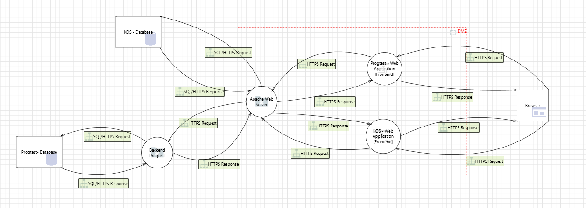

# Analýza Hrozieb a Tvorba Opatrení

- [Analýza Hrozieb a Tvorba Opatrení](#analýza-hrozieb-a-tvorba-opatrení)
- [Introduction](#introduction)
    - [Bezpečnostné Modelovanie (Security Modeling):](#bezpečnostné-modelovanie-security-modeling)
    - [Navrhnutie Opatrení (Threat Mitigation):](#navrhnutie-opatrení-threat-mitigation)
    - [Generovanie Bezpečnostného Reportu (Security Report Generation):](#generovanie-bezpečnostného-reportu-security-report-generation)
- [Task](#task)
    - [Aplikácia KOS](#aplikácia-kos)
    - [Aplikácia Progtest](#aplikácia-progtest)
- [Návrh a Vypracovanie Modelu](#návrh-a-vypracovanie-modelu)
- [Genrovanie Reportu](#genrovanie-reportu)
- [Záver](#záver)

# Introduction

V rámci tejto úlohy bolo zadané vykonať bezpečnostné modelovanie a navrhnúť opatrenia na ochranu aplikácie/systému pred potenciálnymi bezpečnostnými hrozbami. 

Úloha je rozdelená do nasledujúcich krokov:

### Bezpečnostné Modelovanie (Security Modeling):

- Vytvorenie bezpečnostného modelu aplikácie alebo systému v nástroji Microsoft Threat Modeling Tool.

- Identifikácia komponentov, procesov a vzťahov medzi nimi v modeli.

### Navrhnutie Opatrení (Threat Mitigation):

- Identifikácia potenciálnych bezpečnostných hrozieb na základe vytvoreného modelu.

- Navrhnutie konkrétnych opatrení a stratégií na ochranu aplikácie alebo systému pred týmito hrozbami.

### Generovanie Bezpečnostného Reportu (Security Report Generation):

- Vytvorenie bezpečnostného reportu, ktorý obsahuje podrobnosti o bezpečnostnom modeli a navrhnutých opatreniach.

- Report môže obsahovať popis identifikovaných hrozieb a konkrétnych opatrení na ich ochranu.

# Task

Organizácia prevádzkuje dve webové služby: KOS a Progtest. Obe aplikácie sú prístupné pre študentov cez internet pomocou HTTPS protokolu. Študenti pristupujú k týmto aplikáciám prostredníctvom webových prehliadačov, ako sú Firefox, Chrome alebo Edge. Ich pripojenie k aplikáciám prebieha cez webový server Apache HTTPd, ktorý je umiestnený v demilitarizovanej zóne (DMZ).

Tento webový server slúži ako PROXY server, ktorý pri prijatí požiadavky odkazuje dotaz na ďalšie spracovanie. 

### Aplikácia KOS

- Všetka logika je implementovaná pomocou PL/SQL funkcií priamo v databáze Oracle.

- Dáta aplikácie sú taktiež uložené v tejto istej databáze.

- Pre účely zjednodušenia tohto príkladu, predpokladáme, že komunikácia medzi PROXY serverom a DBMS Oracle prebieha cez HTTPS protokol.

### Aplikácia Progtest

- Aplikácia má vlastný webový aplikačný server, ktorý zabezpečuje vykonávanie logiky aplikácie.

- Táto aplikácia je taktiež pripojená k DBMS Oracle, avšak k inému inštancii, než je to v prípade aplikácie KOS.

- Komunikácia medzi PROXY serverom, webovým aplikačným serverom a DBMS pre aplikáciu

- Progtest prebieha taktiež cez HTTPS protokol.

# Návrh a Vypracovanie Modelu

Pre zobrazenie modelu bude potrebné stiahnuť súbor [model.tm7](./model.tm7) a otvoriť ho v programe [Microsoft Threat Modeling Tool](https://www.microsoft.com/en-us/securityengineering/sdl/threatmodeling).

Ukážka modelu:

# Genrovanie Reportu

Report bol vygenerovaný priamo cez [Microsoft Threat Modeling Tool](https://www.microsoft.com/en-us/securityengineering/sdl/threatmodeling) a je možné ho nájsť ako súbor [report.html](./report.html)

# Záver

Podrobnejšie informácie o vybraných hrozbách ku ktorým boli popísané návrhy opatrení je možné nájsť v súbore [Analýza Hrozieb a Tvorba Opatrení.docx](./Analýza%20Hrozieb%20a%20Tvorba%20Opatrení.docx)
